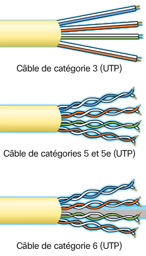
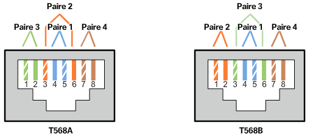
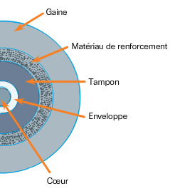
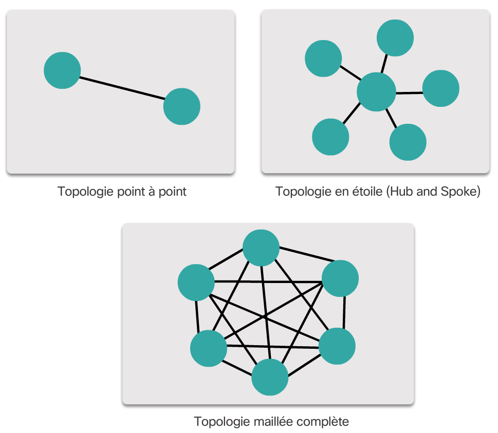
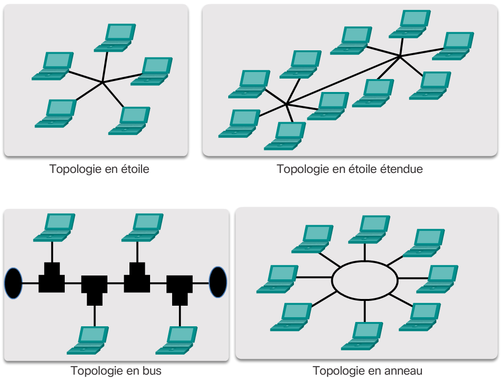
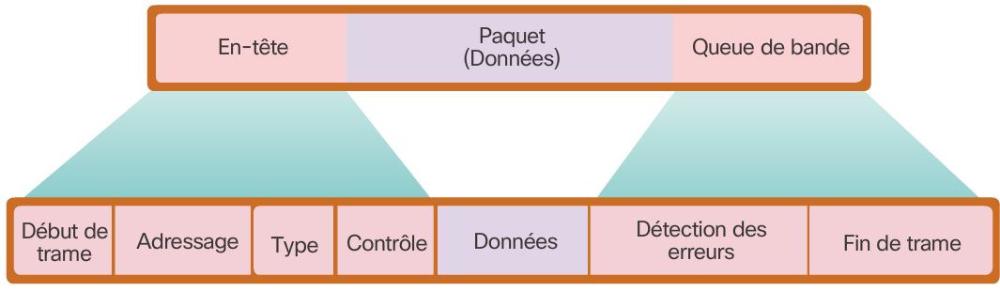

# Chapitre 4 : Accès réseau

## Couche physique

Après la segmentation et la formation des trames par la couche liaison de données, la couche physique transmet individuellement les trames sur le canal de communication puis les signaux reçus par le destinataire qui reconstitue les trames et le désencapsule pour les interpréter.

Il existe 3 formes élémentaires de supports physiques :

* **Câble en cuivre** Les signaux sont des impulsions électriques
* **Câble à fibre optique** Les signaux sont des variations de lumière
* **Sans fil** Les signaux sont des variations de transmission d'hyperfréquences

Tous ces aspects sont gérés par des organismes de normalisation suivants : 

* ISO (International Standards Organization)
* TIA/EIA (Telecommunications Industry Association/Electronic Industries Association)
* IUT (Union International des Télécommunication)
* ANSI (American National Standards Institute)
* IEEE (Institute of Electrical and Electronics Engineers)
* D'autres autorités gouvernementales comme la FCC ou l'ETSI
* Des organismes locaux tels que la JSA/JIS, la CENELEC ou le CSA

Cette couche physique couvre 3 grandes fonctions :

* Les composants physiques en charge de transmettre le signal tel que les ports Ethernet, les câbles ou autres systèmes
* Le codage permettant de convertir le flux de données dans une suite de variations compréhensible par les deux extrémités du canal de transmission
* La méthode de signalisation permettant de représenter un 1 ou un 0 dans le canal de transmission

### Bande passante & Débit

La bande passante est la capacité du support à transporter les données. On mesure cette bande passante par une quantité de données pouvant circuler sur une certaine période. Elle est le plus souvent exprimée en Kbit/s, e, Mbit/s ou en Gbit/s.

Cette bande passante peut varier selon les propriétés du support physique et les technologies choisies pour signaler ou détecter les signaux.

Le débit est une mesure effectuée par la mesure de la quantité de données échangées durant une certaine durée. Ce débit n'atteint pas souvent la bande passante estimée car il varie selon :

* La qualité du trafic
* Le type de trafic
* La latence crée par le nombre de périphériques sur le réseau, c'est à dire le temps nécessaire pour les données de voyager d’un endroit à un autre.

Le *Débit applicatif* mesure quant à lui le débit utilisable et exclue la surcharge de Traffic du réseau par l'établissement de connexion ou les accusés de réception.

## Cuivre

Le support en cuivre représente un système bon marché de communication mais présente un problème: les perturbations. En effet, un courant électrique peut être perturbé de multiples façon mais en voici les deux principaux :

* **Interférences électromagnétiques (EMI) et les interférences radioélectriques (RFI)** Ces interférences produites par des agents extérieurs peuvent modifier le signal; on peut contrer ce phénomène par le blindage des câbles réseaux. 
* **Diaphonie** Un phénomène ou deux câbles conjoints se perturbent; on peut contrer ce phénomène par la torsade des câbles.

Il est alors logique que plus un câble est long plus il est sujet aux perturbations, il faut donc se restreindre dans la longueur de ceux-ci.

Il existe 3 principaux supports en cuivre :

* **UTP (paires torsadées non blindées)** Le type de câble le plus répandu terminé par une connexion RJ-45; il se compose de 4 paires de fils entourés d'une gaine
* **STP (Paires torsadés blindées)** Plus onéreux, il présente en plus des propriétés de l'UTP, un filet de métal qui, correctement mis à la terre, permet de contrer les interférences extérieures.
* **Coaxial** Tends à se faire remplacer par les câbles à paire torsadés, ils se présentent par un câble conducteur puis un blindage séparé par une gaine; ils sont toutefois encore utilisés dans les connexions sans fil ou de câble internet

Les câblages en cuivre présentes des risques de sécurité en matière d'incendie due à la faible protection de ceux-ci mais aussi électriques dans le cas d'un dysfonctionnement ou de la foudre, envoyant un fort courant dès le câble.

### UTP

Les câbles UTP ne disposent pas de protection contre les perturbations extérieures, on suit alors les solutions suivantes : 

* **Annulation** Par le couplage des fils qui ont un champ magnétique inverse, on arrive à annuler leurs perturbations et celles de l'extérieur.
* **Nombre de torsades** Pour éviter tout problème on varie le nombre de torsade par pair de fils sur chacune des paires du câble

Les câbles sont divisés en catégories permettant un plus ou moins gros débit

|Catégorie|Débit|
|---------|-----|
|3|<100 Mbit/s|
|5|100 Mbit/s|
|5e et 6|1000 Mbit/s|
|6e|10 Gbit/s|

Les câbles UTP sont souvent terminés par des connecteurs RJ-45 qui doivent être de bonne qualité pour permettre de bonnes performances.

Pour parfaitement répondre aux attentes, on doit correctement choisir les câbles en fonction de leur organisations internes, on a donc :

* **Câble Ethernet droit** Le câble le plus utilisé et présente la même configuration des deux côtés; O l'utilise pour connecter un hôte a un périphérique réseau; On retrouve alors deux connecteurs T568A
* **Câble Ethernet croisé** Moins utilisé et présente des câbles inverses d'un côté et de l'autre; On l'utilise pour connecter deux appareils similaires; On y retrouve alors les deux connecter, un de chaque cotés
* **Câble inversé** Réservé à Cisco, il permet une communication entre le port série d'une machine et le port console d'un routeur.

### Fibre Optique

La fibre optique est un fil pur et transparent de la taille d’un cheveu humain. Les données sont codées par des impulsions lumineuses. On utilise la fibre optique pour relier des périphériques réseaux le plus souvent car elle permet des débits très important qu'elle est la seul à pouvoir supporter.

La technologie de fibre optique est actuellement utilisée dans :

* Les réseaux d'entreprise
* La technologie FTTH (Fiber to the home)
* Les réseaux de longue distance
* Les réseaux sous-marins

La fibre optique se compose :

* D'un **cœur** transmettant la lumière
* D'une **enveloppe** Fonctionnant comme un miroir réfléchissant la lumière du cœur
* D'un **tampon** protégeant le cœur
* D'un **renforcement** évitant l'étirement de la fibre
* D'une **gaine** protégeant le tout

Les signaux sont envoyés dans un fibre optique par le biais d'une DEL ou d'un laser. Mais les câbles de fibre optique sont classés en deux types:

* **(SMF) Fibre Monomode** Le cœur est réduit et le laser est utilisé pour transmettre les données, la lumière passe de manière droite dans le cœur et ainsi empêche la dispersion; on l'utilise pour le transport de longue distance (100 Km minimum) car cette technologie est couteuse
* **(MMF) Fibre Multimode** Le cœur est plus large et utilise une DEL pour envoyer le signal; la lumière est réfléchie sur l'enveloppe et permet une transmission moins couteuse mais une dispersion plus importante; elle offre un débit de 10GBit/s sur 550 mètres maximum

Les fibres optiques utilisent des types de connecteurs spécifiques :

* **ST** L'un des premiers connecteurs produits, il se connecte à l'aide d'une baïonnette à tourner
* **SC** Un connecteur de forme carrée se clipsant pour vérifier la connexion
* **LC** Une version réduite du connecteur SC
* **LC bidirectionnel** Dispose de deux connecteurs pour une connexion bidirectionnelle

Dans tous les cas, une fibre optique est monodirectionnel, il est ainsi requis de connecter deux fibres.

On choisira la fibre optique sur des installations nécessitant un fort Traffic comme les point d'entrée pour entreprise mais on préfèrera un réseau en cuivre pour disperser de manière individuelle les accès au réseau car la technologie de fibre est encore couteuse et difficile à maintenir.

### Sans fil

Le sans-fil est un réseau qui se déploie rapidement due aux nouveaux périphériques et nouveaux usages. En revanche la communication sans fil impose une zone de couverture restreinte, des interférences plus présentes, une sécurité moins importante et un support partagé par de multiples appareils pouvant être surchargé.

Le sans-fil impose que les bits sont codés sur un signal radio et implique du matériel spécifique pour émettre et recevoir ce type de connexion.

Nous allons traiter ici les normes sans fil de courte ou moyenne portée soit : 

* **Wi-Fi** La technologie WLAN se basant sur le protocole CSMA/CA; La carte réseau commence par écouter avant d'émettre pour éviter toute collision
* **Bluetooth** Une technologie de réseau personnel (SAN) utilisant un protocole de jumelage et permettant une communication sur 100m maximum
* **WiMax** Une technologie sans fil se basant sur une topologie point-à-multipoint pour fournir l'accès au réseau

Mettre en place un réseau local sans fil implique de mettre en place certains systèmes tel qu'un point d'accès sans fil ainsi qu'une carte sans fil sur chaque hôte. Les équipements doivent être choisis avec soins sans quoi, les équipements risquent une incompatibilité.

## Couche Liaison de données

La cohue liaison de données doit :

* Accepter et encapsuler les paquets de la couche 3
* Préparer les donnes pour la transmission physique
* Echanger les trames entre les nœuds
* Recevoir et désencapsule les paquets pour les couches supérieures
* Détecter les erreurs

La couche se divise en deux sous couches :

* **Sous couche LLC (Logical Link Control)** Qui place les informations dans la trame finale et indique le protocole utilisé pour la transmission
* **Sous couche d'accès au support (MAC)** définis les processus pour accéder aux supports réseaux et gère les différentes technologies.

La trame de la couche 2 est amené a changé dès que la trame quitte un réseau spécifique au travers d'un routeur. Il est aussi possible que les protocoles utilisés pour la transmission ne soient pas IP mais les données restent les mêmes. Ainsi, la trame de la couche 2 est renouvelée à chaque tronçon de réseau qu'elle traverse. Dès qu'une trame arrive sur un appareil de couche 3, il désencapsule la trame de couche 2 puis la ré encapsule selon le protocole utilisé pour transmettre les données sur le tronçon suivant.

Ce sont L'IEE, l'UIT, l'ISO et l’ANSI qui font les normes de trames de couche 2.

## Topologies

Pour accéder au réseau, la sous couche MAC (accès réseau) met en place des règles permettant à chacun d'envoyer et de recevoir des données sans collision. Ces règles dépendent de la topologie du réseau et du système de partage du support physique.

La topologie d'un réseau est son organisation des périphériques qu'il contiens. On peut en différencier deux représentations :

* **Topologie physique** montrant les relations physiques des périphériques entre eux par des câbles
* **Topologie logique** montrant les relations entre les nœuds du réseau et la manière par laquelle ils communiquent. On représente alors des connexions virtuelles entre les nœuds du réseau.

### Topologies WAN

* **Point à point** La topologie la plus simple composée d'une connexion permanente entre deux points; Le système n'ayant pas à vérifier que l'hôte recherché soit bien connecté, le protocole de transmission peut être très simple
* **Point à point logique** Sensiblement la même que le point à point physique sauf que la liaison n'est pas physique mais au travers d'un réseau, ce qui ne change pas la topologie car les deux machines sont spécifiquement connectées entre elles
* **Hub and Spoke** La version WAN de la topologie LAN en étoile. Un point central connecte un certain nombre de point périphériques.
* **Maillée** Une topologie permettant une haute disponibilité mais impliquant que chacun des points 

### Topologies LAN

* **Étoile** Chaque périphérique final est relié à un périphérique intermédiaire central; Cette topologie présente une facilité de mise en place et d'évolution; elle est donc très utilisée
* **Étoile étendue** Dans un système étendu, les périphériques intermédiaires sont reliés entre eux et constituent chacun un point centrale d'un ensemble en étoile
* **Bus** Une topologie ou tous les périphériques sont reliés entre eux dans une chaine qui se termine sur des bouchons de terminaison; Les commutateurs ne sont, ici, pas nécessaires; La topologie en bus était très utilisée il y a quelques années pour leur facilité d'installation et d'utilisation
* **Anneau** Chacun des hôtes est relié à son voisin, ce qui forme un anneau et ainsi n'ont pas besoin d'être terminés; cette topologie est utilisée dans les réseau FDDI (Fiber Distributed Data Interface) et Token Ring.

Dans chaque réseau la communication peut se faire selon deux types d'organisation : 

* **Communication en mode Semi-Duplex** Utilisé sur les anciens réseaux et les réseaux sans fil, les hôtes peuvent communiquer dans les deux sens mais pas en simultané
* **Communication en mode Duplex Integral** Les deux périphériques peuvent converser dans les deux sans simultanément en prenant en compte qu'ils ont toujours l'autorisation de communiquer

Chacun des hôtes doit ensuite savoir quand il peut envoyer des données sur le réseau car une seul trame peut circuler a la fois sur un même réseau. On peut alors mettre en place un **Accès contrôlé** ou chacun des hôtes émet quand c'est son tour. Ce type d'échange était utilisé dans les réseau Token rings mais est peu efficace. On peut alors utiliser un système de **gestion des conflits** autorisant tous les hôtes à émettre à tout moment mais prends des mesures pour éviter les collisions comme dans le protocole Ethernet.

Sur un réseau semi-duplex, on met en place un système de gestion des conflits *CSMA/CD*. Dans ce système, chaque carte réseau vérifie avant chaque émission qu'aucune émission n'est déjà en cours. L'émission commence ensuite. Comme l'adresse de destination est spécifiée, toutes la machines ne possédant pas cette adresse ne prennent pas en compte la trame. Si une collision vient à se produire, les carte réseau la détecte et envoie un signal avertissant qu'il faut renouveler l'envoie. Une alternative est le système *CSMA/CA* dans lequel, chacun des hôtes essayent d'éviter la collision en estimant le temps requis pour transmettre les données. 

## Trame

La couche liaison de données encapsule les données précédemment encapsulés par les autres couches dans une trame composé d'en-têtes, des données et d'une queue de bande. Tous les protocoles de cette couche suivent ce système, seul diffère la taille de ces éléments en fonction de l'environnement. En effet, plus des informations sont successible d'être perdues plus il faut d'informations pour les reconstituer et ainsi de plus grands en-têtes et donc un débit moins important.

L'encapsulation des données par la couche 2 s'appelle le *verrouillage de la trame*. Cette trame contient diverses informations comme montré dans la figure suivante.

* **Indication de début et de fin** Elles permettent d'identifier le début et la fin de la trame. Tant que la fin n'est pas atteinte, le destinataire attends d'autres données.
* **Adressage** Le nœud source et de destination
* **Type** Le protocole de couche 3 utilisé dans les données
* **Contrôle** Une zone prévue pour vérifier la qualité du service de réseau et utilisé pour donner la priorité à certains messages
* **Détection des erreurs** un champ permettant de vérifier qu'aucune erreur n'est survenue

Les Trames diffère selon le protocole de couche 2 utilisé en fonction de l'emplacement du réseau et de son étendue. Ainsi on peut retrouver :

* Ethernet
* 802.11 sans fil
* PPP (Point-To-Point Protocol)
* HDLC
* Frame Relay
