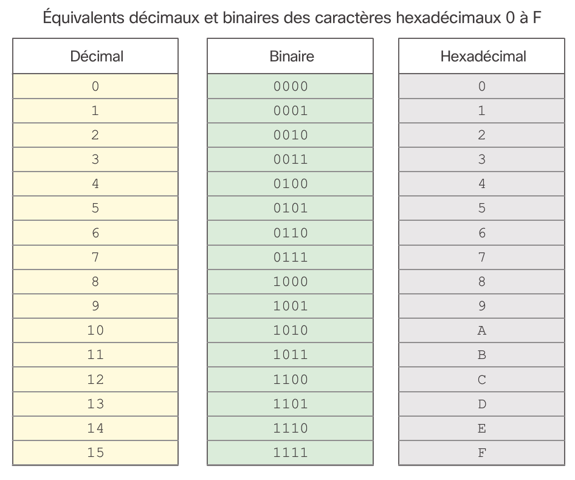

# Chapitre 5 : Technologie Ethernet

Ethernet est la téchnologie LAN la plus utilisée aujourd'hui. Elle se positionne sur la couche liaison de données et prend en charge des bandes passantes de 10, 100, 1000, 10000, 40000 et 100000 MBit/s. Cette norme définit un protocole de la couche 2 et 3 et se divise en deux sous-couches:

* **LLC** qui gère la communication entre les couches supérieures et inférieures. Cette couche est purement logicielle et indépendante du materiel.
* **MAC** La sous-couche inférieure, elle est mise en oeuvre au niveau matériel des cartes réseau de la machine.

Ethernet fut créé en 1973 et n'a cessé d'évoluer pour augmenter sa bande passante et devenir plus flexible.

## Sous-couche MAC

Cette sous couche a deux objectifs, encapsuler les données et contrôler l'accès au support.

Cette sous couche en charge de l'encapsulation gère donc: 

* **La delimitaition des trames** permettant la synchronisation de l'emetteur vaec le récépteur
* **L'adressage** physique de la trame
* **Detection des érreurs**

La sous couche gère aussi l'accès au support et vérifie ainsi la disponibilité de celui ci et les éventuelles collisions.

La structure d'une trame Ethernet est la suivante:

### Structure de trame

La trame ethernet se présente comme suit, sa taille peut varier entre 64 et 1518 octets. Toute trame plus petite ou plus grande sera interprétée comme un fragment de collision.

Une trame plus grande que 1518 octets est consiérée comme une trame "Jumbo" ou "Baby giant frames"

|Préambule|Adresse de destination|Adresse source|Type|Données|Contrôle de trame|
|---------|----------------------|--------------|----|-------|----------------|
|8 octets|6 octets|6 octets|2 octets|46 a 1.500 octets|4 octets|

* **Préambule** Délimiteur de trame (SFD) utilisé pour synchroniser l'émetteur avec le récépteur
* **Adresse MAC de destination** L'identifiant physique du destinataire permettant une monodiffusion, multidiffusion ou une diffusion
* **Adresse MAC source** L'identifiant d'origine de la trame
* **EtherType** Un champ identifiant le protocole de la source précédente
* **Données** Les données encapsulées de la couche supérieure
* **Fin de trame (FCS)** Permettant de detecter les érreurs de trame et de la terminer

> Exemple : Quelques types de protocoles : 
> * 0x800 pour IPv4
> * 0x86DD pour IPv6
> * 0x806 pour ARP

### Adresse MAC

L'hexadécimal est le système d'écriture des adresses MAC et des adresses IP. Il se présente comme une système de nombre de 0 a 9 et de A a F dont les équivalences sont faites dans le tableau ci dessous.

On représente une adresse MAC en regroupant les caractères hexadécimaux par paire et en les séparant par des `-` ou des `:` ou bien par le regroupement par 4 et la séparation par des `.`

> Exemple :
> 00-05-9A-3C-78-00
> 00:05:9A:3C:78:00
> 0005.9A3C.7800

Une adresse MAC est constituée de deux parties de 24 Bits, l'une définie par la IEEE et propre à chaque constructeur et une autre laissée au choix du constructeur. Ainsi, on est assuré qu'une adresse MAC est unique au niveau mondial. Ce système est appelé *OUI* pour Organizationally Unique Identifier.

Le plus souvent l'adresse MAC est gravée dans la mémoire morte de la carte réseau, elle est ainsi dite rémanente (BIA). On peut toutefois la changer logiciellement dans le système d'exploitation. Lors du démarrage, cette adresse rémanente est stockée dans la mémoire vive pour etre utilisée.

Quand un paquet atteint la carte réseau, la carte réseau compare l'adresse MAC de destination par rapport a celle stockée en mémoire vive et interprète le paquet s'il est la destination.

Les commutateurs utilisent deux types de méthodes pour transferer les trames vers le port associé :

* **Cut-Through**: Achemine la trame avant qu'elle ne soit complètement lue et ne contrôle pas les érreurs; dans la variante fast-forward, les donnes sont immediatement transmises et cela peut poser certains problèmes mais permet un fort débit;La seconde variante Fragment-free consiste a stocker les 64 premiers octets avant de conclure à un port vers lequel communiquer et procéder à un petit check des erreurs de trames
* **Store and Forward**: Enregistre la trame dans la mémoire et pendant que la trame est en train d'etre enregistrée, le commutateur décide du port vers lequel acheminer la trame et procède a un test de redondance cyclique (CRC) en analysant l'en-queue de la trame pour vérifier que la trame est valide pour ne pas engorger le réseau de données invalides.

Pour permettre une bonne transmission, les commutateurs sont munis de mémoire tampons pouvant être de deux types :

* **Axé sur les ports**: Les trames sont stockées dans les files d'attente associées à chaque ports entrant et sortant; les données sont transmises dès que le port se libère
* **Mémoire partagée**: Une seul mémoire reprend toutes les trames et le port de destination est alloué dynamiquement

Le protocole Ethernet peut fonctionner en semi-duplex ou en duplex integral, lors d'une connexion au commutateur ou un autre périphérique, les deux périphériques échangent pour choisir le meilleur moyen de transmission en fonction du système offrant la meilleur bande passante. Si on ne s'accorde pas on risque beaucoup de collisions sur le canal provenant du système en semi-duplex.

Un autre point sur lequel s'accorder est le type de cable utilisé. Pour eviter une configuration, on utilise le système Auto-MDIX permettant, par de multiples exhanges entre commutateur et autre périphérique de conclure au type de cable utilisé et ainsi de modifier les configurations en conséquence.

## ARP

Si l'adresse IP de destination n'appartient pas au réseau actuel, la machine l'envoie automatiquement à la passerelle, une machine de couche 3 permettant de faire la liaison avec un réseau distant.

Pour associer une adresse IP aux adresses MAC le long du chemin on utilise le protocole ARP permettant de résoudre les adresses MAC et de tenir une table de mappage.

Pour résoudre les adresses MAC à partir de l'adresse IP d'un périphérique, il consulte la table de mappage contenu dans sa mémoire vive. Si l'adresse MAC correspondante n'est pas présente, il envoie une requète ARP sur le réseau.

Une requète ARP contient dans son corps, soit l'adresse IP cible soit l'adresse MAC cible dont il faut compléter le couple. Et la trame ethernet de ce type de requête contient en en-tete :

* **L'adresse MAC de diffusion** permettant à chacun de répondre
* **L'adresse MAC source** de la machine émettrice
* **Le type de trame** soit 0x806 dans le cas d'une requète ARP

Apres cette requête seule la machine correspondant à l'IP renseingnée dans le corps répond avec l'adresse IP de l'expéditeur et son adresse MAC. Et s'accompagne d'une trame ethernet standard de monodiffusion avec le type ARP. Dès que le périphérique éméteur reçoit la réponse il l'ajoute à sa table de mappage et envoie la trame prévue.

Les entrées de la table de mappage sont rapidement éffacées si elles ne sont pas utilisées depuis un certains temps mais cela dépend du système d'exploitation.

Pour afficher la table de mappage on peut utiliser la commande `show ip arp` sur les appareils Cisco ou `arp -a` sur Windows.

Si de nombreuses demandes ARP sont diffusées en même temps sur un réseau à faible bande passante cela peut inonder le réseau, mais ce genre de pertes de performances reste minimes.

Certains pirates peuvent se faire passer pour un autre périphérique en répondant à certaines requêtes ARP qui ne lui sont pas destinées et ainsi empoisonner la table de mappage du périphérique.
