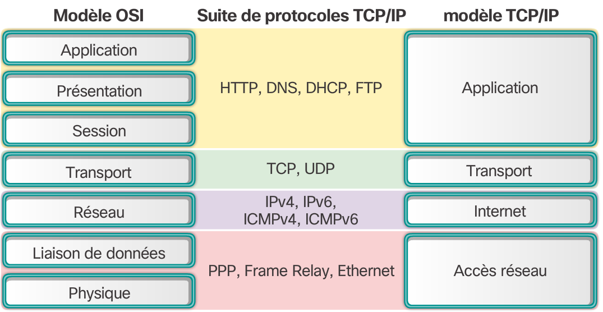

# Chapitre 3 : Protocoles et communication réseau

## Structure d'une communication

Toute communication peut être représenté par 5 éléments principaux et la communication entre ordinateurs ne fait exception : 

* La source du message à émettre (La machine source)
* L'émetteur du signal (la carte réseau source)
* Le support de transmission (cuivre, air ou fibre optique)
* Récepteur du message (carte réseau de destination)
* Destinataire du message (machine de destination)

Pour convenablement communiquer, les machines doivent s'accorder sur une langue partagée pour communiquer. C'est cela que l'on appelle *protocole*. Il en existe un grand nombre qui sont normalisés pour permettre une communication correcte. Ce protocole définit les informations que la machine source doit fournir pour se faire comprendre par le réseau.

Pour correctement transmettre le message, les machines utilisent non pas un seul protocole mais une suite ajoutant chacun de nouvelles informations permettant de transmettre le message. On appelle cette organisation la *suite de protocoles*. Ainsi le message à envoyer est encapsulé par chacun des protocoles permettant sa transmission.

### Codage

Pour les besoins de la transmission, les données qui vos être envoyés doivent subir une transformation permettant de les rendre compatibles avec le support de transmission et le protocole utilisé. C'est cette opération que l'on appelle *codage*

> Exemple : Dans une conversation téléphonique, chaque son reçu est codé sous forme de bit puis envoyé au destinataire qui reconstitue le son à parti des informations reçues.

### Encapsulation

Le message brut, même codé, ne peut être envoyé tel quel sur le réseau, il faut lui fournir d'autre informations comme le destinataire de la lettre ou l'expéditeur. Ces informations sont ajoutées au début ou à la fin du message à envoyer. L'encapsulation consiste alors en l'ajout d'informations au message brut en fonction des informations requises par le réseau. L'ensemble du message encapsulé est appelé *trame* et peut être envoyé sur le réseau. Il peut y avoir plusieurs phases d'encapsulation d'un message.

Par exemple dans le cas d'une trame HTTP on trouve le contenu de la page à afficher dans les données utilisateur puis une série d'encapsulation ajoutent des informations à la trame permettant de préciser sa destination, la version des protocoles utilisés, et bien d'autres choses.

### Taille

Pour respecter le protocole utilisé pour la transmission, le message peut être divisé en plusieurs *trames* permettant ainsi de ne pas engorger le réseau.

### Synchronisation et gestion des trames

Lorsque deux hôtes envoient une trame au même moment sur le réseau, il se produit une *collision*. Pour éviter ce genre de chose, le protocole doit définir une *méthode d'accès* définissant le moment ou les hôtes doivent parler et que faire en cas d'erreur.

Pour éviter d'engorger le réseau, le protocole doit aussi spécifier un système de *contrôle de flux* pour donner une chance à chaque hôte d'envoyer des données sur le réseau.

Enfin, le protocole doit aussi définir un *délai d'attente*, qui dépassé, autorisera l'hôte émetteur sans réponse de considérer qu'aucune réponse n'a été donnée.

### Méthode d'envoie

L'envoie d'une trame peut s'effectuer de 3 façon différentes :

* **Monodiffusion** On envoie la trame a un seul hôte
* **Multidiffusion** On envoie la trame a un groupe d'hôtes
* **Diffusion** On envoie la trame a tous les hôtes du réseau

Chacune des trames peut demander ou non un accusé de réception.

## Protocol réseau

Les protocoles qui régissent les réseaux sont des protocoles définis, précis et acceptés par toutes les machines qui l'utilisent. Il existe de nombreux protocoles et ces protocoles sont organisés en *suites de protocoles* permettant une bonne communication.

Un protocole peut être :

* **Ouvert** Il est alors normalisé par un organisme de normalisation et peut être utilisé partout et par tous
* **Propriétaire** Il est alors normalisé par l'entreprise qui l'a créé et ne peut être utilisé que par cette même entreprise.

Il existe de nombreuses suites des protocoles mais en voici quelques exemples

La suite de protocoles TCP/IP se compose aujourd'hui beaucoup de protocoles donnés dans la figure suivante.

Les protocoles sont empilés en couches. Pour utiliser un protocole application, on a alors besoin d'utiliser un ou plusieurs protocoles par couche inferieur et d'effectuer l'encapsulation.

### Protocoles application

* **DNS** Pour Domaine Name System, permet de traduire le nom de domaine en adresses IP
* **BOOTP** Prédécesseur de DHCP, il permet à une machine de connaitre son IP sur le réseau
* **DHCP** Pour Dynamic Host Configuration, attribue dynamiquement des adresses IP aux clients et permet de réutiliser les adresses ip non utilisés.
* **SMTP** Pour Simple Mail Transfert Protocol, permet aux client d'envoyer un email a un serveur de messagerie et au serveur d'envoyer ce mail à d'autres serveurs
* **POP** Pour Post Office Protocol, permet de récupérer des emails depuis un serveur de messagerie, ces emails sont téléchargés du serveur vers le bureau
* **IMAP** Pour Internet Message Access Protocol, permet d'accéder aux emails d'un serveur de messagerie et conserve ces emails à distance
* **FTP** Pour File Transfert Protocol, définis les règles qui permettent à l'utilisateur d'un hôte d'accéder à des fichiers sur un autre hôte du réseau et de transférer des fichiers vers cet hôte distant
* **TFTP** Pour Trivial file transfert protocole, permet de transférer des fichiers simples sans connexion et sans accusé de réception
* **HTTP** Pour HyperText Transfer Protocol, permet de transférer des médias, textes et graphiques sur le web.

### Protocoles de transport

* **UDP** Pour User datagramme Protocol, permet de transférer des paquets d'un hôte vers un autre sans accusé de réception.
* **TCP** Pour Transmission Control Protocol, permet une communication fiable entre les processus de deux hôtes distants avec accusé de réception

### Protocoles Internet

* **IP** Pour Internet Protocol, permet de regrouper les messages en paquets et indiquer l'adresse de destination
* **NAT** Permet de convertir les adresses locales en adresses globales sur le réseau mondial
* **ICMP** Pour Internet Control Message Protocol, permet de signaler à l'hôte distant les erreurs survenues lors de la transmission
* **OSPF** Pour Open Shortest Path First, permet de router les paquets dans la bonne direction par une conception hiérarchique des zones
* **EIGRP** Pour Enhance Interior Gateway Routing Protocol, un protocole propriétaire Cisco permettant de donner une métrique appropriée en fonction de la bande passante

### Protocoles d'accès réseau

* **ARP** Pour Address Resolution Protocol, Fournis un mappage dynamique entre une adresse IP et une adresse physique
* **PPP** Pour Point-to-Point Protocol, permet d'encapsuler les paquets pour les transmettre par une connexion série
* **Ethernet** Le protocole le plus utilisé en local permettant de définir les règles de câblage et de signalisation
* **Pilotes d'interface** Donne les instructions à l'ordinateur pour communiquer avec ses interfaces réseau

## Normes ouvertes

Avoir une norme ouverte permet de :

* Favoriser l'inter-compatibilité des produits
* Empêcher le monopole d'un produit

Une norme ouverte est gérée par un organisme de normalisation qui est, le plus souvent, une association à but non lucratif qui ne sont liés a aucun constructeurs

### Organismes de normalisation Internet

* **ISOC** Pour Internet Society, en charge de la promotion d'un internet libre
* **IAB** Pour Internet Architecture Board, un comité en charge de la gestion et de développement des normes internet
* **IETF** Pour Internet Engineering Task Force, un groupe de travail chargé de développer, mettre à jour et gérer les technologies internet et TCP/IP par les documents de normalisation comme les RFC
* **IRTF** Pour Internet Research Task Force, un groupe de travail de recherche à long terme sur Internet et TCP/IP dans le domaine de la cryptographie, de l'anti-spam et du Peer-to-Peer
* **ICANN** Pour Internet Corporation for Assigned Names and Numbers, une association qui coordonne l'attribution des adresses IP et la gestion des noms de domaine
* **IANA** Pour Internet Assigned Numbers Authority, une autorité chargée de superviser les adresse IP et les protocoles utilisés pour l'ICANN

### Organismes de normalisations électroniques et communication

* **IEEE** Pour Institute of Electrical and Electronics Engineers
* **EIA** Pour Electronic Industries Alliance, alliance commercial de normalisation de câbles et des communications en racks notamment
* **TIA** Pour Telecommunications Industry Association, une association responsable des normes de communications dans de nombreux domaines
* **ITU-T** Pour Secteur de la normalisation des télécommunications de l'Union internationale des télécommunications, l'un des plus anciens organismes de normalisation qui définis les normes de compression vidéo notamment.

## Modèle en couches

Nous représentons maintenant notre réseau en couches successives en suivant 2 modèles :

* **Modèle protocole** Ce modèle suite une suite de protocole définis, cette fonction est assurée par le modèle TCP/IP
* **Modèle référant** Assure une cohérence générale de chaque opération à effectuer dans chaque couche, ce modèle est assuré par le modèle OSI

### Modèle OSI

Le modèle ISO se constitue de 7 couches successives : 

* **7.Application** Contient des protocoles utilisés pour les communications de processus à processus
* **6.Présentation** Fournit une représentation commune des données transférées entre des services de couche application
* **5.Session** Fournit des services à la couche présentation pour organiser son dialogue et gérer l'échange de données
* **4.Transport** Définit des services pour segmenter, transférer et réassembler les données de communications individuelles entre les périphériques finaux
* **3.Réseau** Fournit des services pour échanger les parties de données individuelles sur le réseau entre des périphériques finaux identifiés
* **2.Liaison de données** Liaison de données décrivent des méthodes d'échange de trames de données entre des périphériques sur un support commun
* **1.Physique** Décris les moyens mécaniques, électriques, fonctionnels et méthodologiques permettant d'activer, de gérer et de désactiver des connexions physiques pour la transmission de bits vers et depuis un périphérique réseau.

### Modèle TCP/IP

Composé de seulement 4 couches définis par les protocoles utilisés :

* **4.Application** Les données utiles pour l'utilisateur et les contrôles de dialogues
* **3.Transport** Prend en charge la communication entre plusieurs périphériques au travers du réseau
* **2.Internet** Détermine le meilleur chemin réseau
* **1.Accès réseau** Contrôle les périphériques matériels et les supports qui constituent le réseau

## Transfert de données

Les données à transférer ne peuvent être envoyées toute d'un coup car cela poserais des problèmes de données. Il faut prendre en compte deux systèmes permettant d'optimiser le flux de données et de donner la possibilité à tous de communiquer

### Segmentation

Pour réduire la quantité des données à transmettre, on divise les données en plusieurs trames différentes.

### Multiplexage

Pour donner la chance à chaque hôte sa chance de communiquer on entremêle les données de chaque hôte permettant de mixer les paquets transmis.

### Transformation des trames

Lors de l'émission de données par une application, les données passent par la pile de protocoles permettant d'encapsuler les données pour finir sur le canal de communication.

1. Les donnes sont constituées pour être envoyés
2. Les données sont divisées en segments
3. Les segments sont encapsulés suivant la pile de protocoles
4. Les paquets sont constitués pour être envoyés sur le réseau
5. Les bits de la trame sont envoyés sur le support physique

### Désencapsulation

Lors de la réception de la trame, les données sont décapsulées dans le sens inverse de l'encapsulation.

### Adresses réseau

Pour communiquer, il faut un couple d'adresse.

* **Adresse source** d'où proviennent les données
* **Adresse de destination** ou vont les données

Chacune des couches dispose de sa propre méthode de transmission mais les adresses ne sont employées que dans la couche réseau et la couche liaison de données.

* **Couche liaison de données** (adresse MAC) L'adresse est utilisée pour le transfert de carte à carte sur le même réseau. Ainsi la trame de cette couche change dès qu'elle est transférée sur une réseau différent par le biais d'un routeur.
* **Couche réseau** (adresse IP) L'adresse est utilisée de la source jusqu'à la destination même s’ils ne sont pas sur le même réseau elle est composée d'une partie réseau et d'une partie hôte

